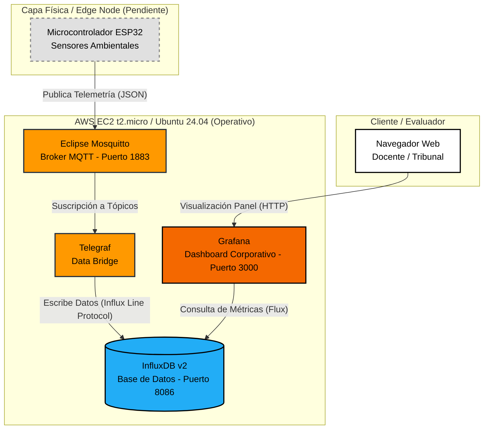
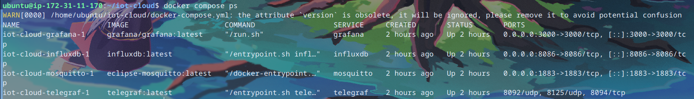
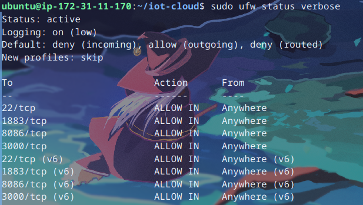
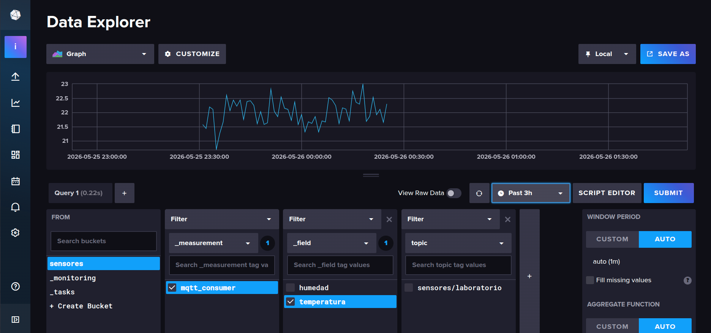
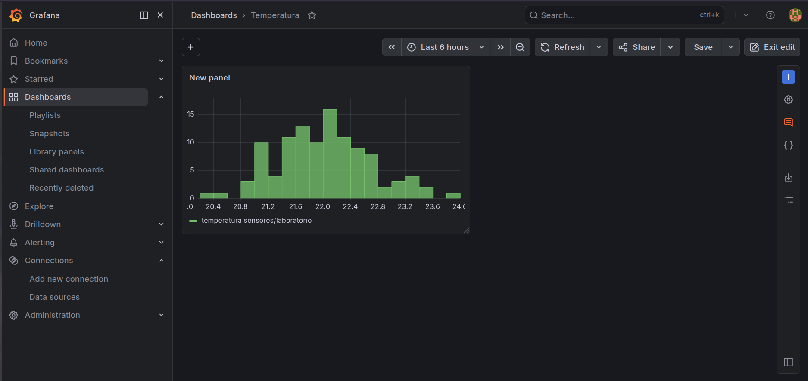

# Informe de Avance — Proyecto Final

**Universidad San Francisco Xavier de Chuquisaca (USFX)**
**Asignatura:** Trabajando en la Nube (COM610)
**Docente:** Ing. Marcelo Quispe Ortega
**Semestre:** 1/2026

**Título del Proyecto:** Plataforma Cloud End-to-End de Ingesta y Visualización de Datos IoT
**Integrantes:**
* Peñaranda Villarroel Hernan Isaac
* Ávila Serrano Christian Ángel

**Enlace al Repositorio:** [https://github.com/isaacpv962/proyecto_final_COM610](https://github.com/isaacpv962/proyecto_final_COM610)

---

## 1. Tabla de Infraestructura y Servicios

| Componente | Rol en la Arquitectura | Tecnología | Puerto / Endpoint | Estado |
| :--- | :--- | :--- | :--- | :--- |
| **Edge Node** | Generación de telemetría física | ESP32 (Pines G) / MicroPython | N/A | Pendiente |
| **Cloud Host** | Servidor IaaS principal | AWS EC2 (t2.micro - Ubuntu 24.04) | `34.201.16.79` | **Operativo** |
| **MQTT Broker** | Recepción de mensajería IoT | Eclipse Mosquitto (Docker) | `1883/tcp` | **Operativo** |
| **Data Bridge** | Transformación e ingesta | Telegraf (Docker) | Interno | **Operativo** |
| **Database** | Almacenamiento de series temporales | InfluxDB v2 (Docker) | `8086/tcp` | **Operativo** |
| **Dashboard** | Panel de visualización corporativa | Grafana (Docker) | `3000/tcp` | **Operativo** |

---

## 2. Diagrama de Arquitectura

*(Leyenda de estado: Los componentes dentro de la caja naranja ya se encuentran operativos en la nube. El componente físico está pendiente para la siguiente fase).*



---

## 3. Comandos Principales Utilizados

**Aprovisionamiento y Conexión (AWS EC2):**
```bash
ssh -i "llave_usfx.pem" ubuntu@IP_PUBLICA_AWS
```

**Despliegue y Orquestación (Docker Compose):**
```bash
# Instalación del entorno
sudo apt install docker.io docker-compose-v2 -y
sudo usermod -aG docker ubuntu

# Despliegue de la infraestructura leyendo variables del .env
docker compose up -d

# Verificación de servicios y redes internas
docker compose ps
docker network ls
```

**Seguridad y Firewall (UFW):**
```bash
# Configuración de políticas restrictivas
sudo ufw default deny incoming
sudo ufw default allow outgoing

# Apertura de puertos específicos
sudo ufw allow 22/tcp
sudo ufw allow 1883/tcp
sudo ufw allow 8086/tcp
sudo ufw allow 3000/tcp
sudo ufw enable

# Verificación de permisos de archivos sensibles
chmod 600 .env
```

---

## 4. Bitácora de Avance

| Fecha | Actividad Realizada | Responsable | Dificultad Superada |
| :--- | :--- | :--- | :--- |
| 25/05/2026 | Aprovisionamiento de instancia EC2 e instalación de entorno Docker. | Hernan Isaac Peñaranda | Resolución de permisos de ejecución en Linux para el socket de Docker sin uso de usuario root. |
| 25/05/2026 | Codificación del archivo maestro de orquestación y despliegue de base de datos/visualizador. | Christian Angel Avila | Corrección de rutas de montaje de volúmenes persistentes para evitar pérdida de datos tras reinicios. |
| 26/05/2026 | Implementación de seguridad perimetral (UFW), ocultamiento de secretos (.env) e integración del puente Telegraf. | Hernan y Christian | Solución de errores de autorización `401 Unauthorized` entre Telegraf e InfluxDB mediante recreación de volúmenes con token inyectado. |

---

## 5. Capturas de Pantalla (Evidencias)

### 5.1. Contenedores Activos y Orquestación

*Descripción: Salida del comando `docker compose ps` evidenciando los 4 servicios core ejecutándose de manera estable y exponiendo los puertos requeridos.*

### 5.2. Reglas de Seguridad y Firewall

*Descripción: Salida del comando `sudo ufw status verbose` demostrando la política restrictiva por defecto.*

### 5.3. Ingesta de Datos en InfluxDB

*Descripción: Consola de InfluxDB registrando la telemetría simulada entrante a través del measurement `mqtt_consumer` procesado por Telegraf.*

### 5.4. Visualización en Grafana

*Descripción: Dashboard corporativo consumiendo la fuente de datos InfluxDB mediante lenguaje de consulta Flux.*