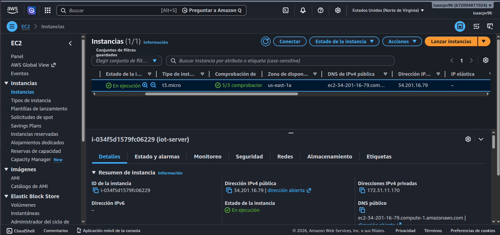

# Informe de Avance — Proyecto Final

**Universidad San Francisco Xavier de Chuquisaca (USFX)** <br>
**Asignatura:** Trabajando en la Nube (COM610) <br>
**Docente:** Ing. Marcelo Quispe Ortega <br>
**Semestre:** 1/2026

**Título del Proyecto:** Plataforma Cloud End-to-End de Ingesta y Visualización de Datos IoT
**Integrantes:**
* Peñaranda Villarroel Hernan Isaac
* Ávila Serrano Christian Ángel

**Enlace al Repositorio:** [https://github.com/isaacpv962/proyecto_final_COM610](https://github.com/isaacpv962/proyecto_final_COM610)

---

## 1. Tabla de Infraestructura y Servicios

| Componente | Rol en la Arquitectura | Tecnología | Puerto / Endpoint | Estado |
| :--- | :--- | :--- | :--- | :--- |
| **Edge Node** | Generación de telemetría física | ESP32 (Pines G) / MicroPython | N/A | Pendiente |
| **Cloud Host** | Servidor IaaS principal | AWS EC2 (t2.micro - Ubuntu 24.04) | `34.201.16.79` | **Operativo** |
| **MQTT Broker** | Recepción de mensajería IoT | Eclipse Mosquitto (Docker) | `1883/tcp` | **Operativo** |
| **Data Bridge** | Transformación e ingesta | Telegraf (Docker) | Interno | **Operativo** |
| **Database** | Almacenamiento de series temporales | InfluxDB v2 (Docker) | `8086/tcp` | **Operativo** |
| **Dashboard** | Panel de visualización corporativa | Grafana (Docker) | `3000/tcp` | **Operativo** |

---

## 2. Diagrama de Arquitectura

*(Leyenda de estado: Los componentes dentro de la caja naranja ya se encuentran operativos en la nube. El componente físico está pendiente para la siguiente fase).*


---

## 3. Comandos Principales Utilizados

**Aprovisionamiento y Conexión (AWS EC2):**
```bash
ssh -i "iot-server-claves.pem" ubuntu@34.201.16.79
```

**Despliegue y Orquestación (Docker Compose):**
```bash
# Instalación del entorno
sudo apt install docker.io docker-compose-v2 -y
sudo usermod -aG docker ubuntu

# Despliegue de la infraestructura leyendo variables del .env
docker compose up -d

# Verificación de servicios y redes internas
docker compose ps
docker network ls
```

**Seguridad y Firewall (UFW):**
```bash
# Configuración de políticas restrictivas
sudo ufw default deny incoming
sudo ufw default allow outgoing

# Apertura de puertos específicos
sudo ufw allow 22/tcp
sudo ufw allow 1883/tcp
sudo ufw allow 8086/tcp
sudo ufw allow 3000/tcp
sudo ufw enable

# Verificación de permisos de archivos sensibles
chmod 600 .env
```

---

## 4. Bitácora de Avance

| Fecha | Actividad Realizada | Responsable | Dificultad Superada |
| :--- | :--- | :--- | :--- |
| 14/05/2026 | Creación de la máquina virtual en la nube (AWS EC2) e instalación de las herramientas de contenedores (Docker). | Peñaranda Villarroel Hernan Isaac | Al principio, el sistema de seguridad del servidor impedía ejecutar las herramientas de contenedores a menos que se usara la cuenta de administrador absoluto (root), lo cual es peligroso. Se solucionó creando un grupo de accesos especiales que permite operar los contenedores de forma segura y controlada sin poner en riesgo todo el servidor cloud. |
| 14/05/2026 | Configuración del archivo maestro de orquestación para coordinar las bases de datos y el panel visual. | Ávilla Serrano Christian Ángel | Inicialmente, cada vez que el servidor se apagaba o se reiniciaba, todas las configuraciones realizadas y los datos de monitoreo acumulados se borraban por completo. Se solucionó configurando "volúmenes persistentes", que actúan como discos duros dedicados para que los programas guarden la información de forma permanente. |
| 16/05/2026 | Configuración y corrección del arranque en el sistema de recepción de mensajes (Mosquitto). | Peñaranda Villarroel Hernan Isaac | El servidor de mensajería no podía encender porque el sistema automatizado confundió un archivo de configuración de texto con una carpeta del sistema, provocando un choque que congelaba el servicio. La dificultad se superó borrando el rastro erróneo mediante comandos de terminal y escribiendo manualmente un archivo de texto limpio con las reglas de acceso correctas. |
| 20/05/2026 | Implementación del muro de seguridad (Firewall UFW) y protección de claves de acceso. | Ávilla Serrano Christian Ángel | Las contraseñas maestras de las bases de datos estaban escritas directamente en el código principal, lo que significaba que cualquiera que viera el proyecto podía robarlas. Se superó aislando todas las claves secretas dentro de un archivo oculto e independiente (`.env`) y activando un muro de seguridad digital que bloquea cualquier ataque externo, dejando abiertos únicamente los puertos indispensables. |
| 21/05/2026 | Integración del puente de datos (Telegraf) y resolución de bloqueos de comunicación interna. | Peñaranda Villarroel Hernan Isaac | El recolector de datos no podía guardar la información porque la base de datos se había creado antes de configurar las nuevas claves de seguridad, por lo que rechazaba las conexiones al no reconocer la contraseña. Se solucionó limpiando la memoria temporal del servidor y forzando a todo el ecosistema a iniciar sincronizado desde el primer segundo con el mismo token de acceso. |

---

## 5. Capturas de Pantalla (Evidencias)

### 5.1. Instancia EC2 AWS

*Descripción: Instancia AWS que aloja la máquina virtual Ubuntu Server evidenciando su ejecución correcta*

### 5.2. Contenedores Activos y Orquestación

*Descripción: Salida del comando `docker compose ps` evidenciando los 4 servicios core ejecutándose de manera estable y exponiendo los puertos requeridos.*

### 5.3. Reglas de Seguridad y Firewall

*Descripción: Salida del comando `sudo ufw status verbose` demostrando la política restrictiva por defecto.*

### 5.4. Ingesta de Datos en InfluxDB

*Descripción: Consola de InfluxDB registrando la telemetría simulada entrante a través del measurement `mqtt_consumer` procesado por Telegraf.*

### 5.5. Visualización en Grafana

*Descripción: Dashboard corporativo consumiendo la fuente de datos InfluxDB mediante lenguaje de consulta Flux.*