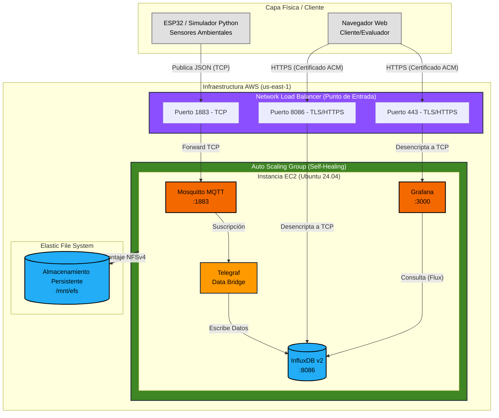
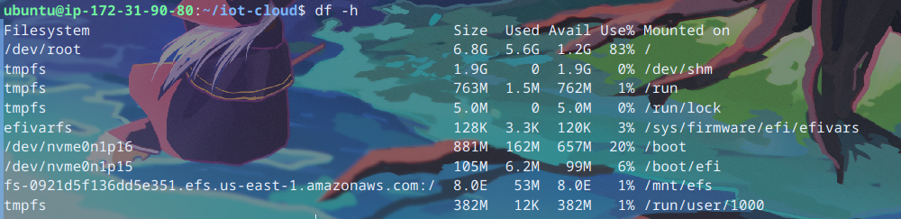

# Informe de Proyecto Final

**Universidad San Francisco Xavier de Chuquisaca (USFX)** <br>
**Asignatura:** Trabajando en la Nube (COM610) <br>
**Docente:** Ing. Marcelo Quispe Ortega <br>
**Semestre:** 1/2026

**Título del Proyecto:** Plataforma Cloud End-to-End de Ingesta y Visualización de Datos IoT
**Integrantes:**
* Peñaranda Villarroel Hernan Isaac
* Ávila Serrano Christian Ángel

**Enlace al Repositorio:** [https://github.com/isaacpv962/proyecto_final_COM610](https://github.com/isaacpv962/proyecto_final_COM610)

---

## 1. Tabla de Infraestructura y Servicios

| Componente | Rol en la Arquitectura | Tecnología | Puerto / Endpoint | Estado |
| :--- | :--- | :--- | :--- | :--- |
| **Edge Node** | Generación de telemetría física | ESP32 (Pines G) / Simulador Python | N/A | **Operativo** |
| **Punto de Acceso** | Balanceador de Carga y SSL | AWS Network Load Balancer (NLB) | DNS Público AWS | **Operativo** |
| **Cloud Host** | Servidor IaaS y Orquestador | AWS EC2 (Auto Scaling Group) | Capacidad: 1-1-1 | **Operativo** |
| **Storage** | Almacenamiento desacoplado | AWS EFS (Elastic File System) | Montaje en `/mnt/efs` | **Operativo** |
| **MQTT Broker** | Recepción de mensajería IoT | Eclipse Mosquitto (Docker) | `1883/tcp` | **Operativo** |
| **Data Bridge** | Transformación e ingesta | Telegraf (Docker) | Interno | **Operativo** |
| **Database** | Almacenamiento de series temporales | InfluxDB v2 (Docker) | `8086/tls` (HTTPS) | **Operativo** |
| **Dashboard** | Panel de visualización corporativa | Grafana (Docker) | `443/tls` (HTTPS) | **Operativo** |

---

## 2. Diagrama de Arquitectura de Alta Disponibilidad

*(Leyenda de estado: La arquitectura representa el entorno de producción actual, con tolerancia a fallos y cifrado en tránsito).*



---

## 3. Comandos Principales Utilizados

**Aprovisionamiento y Conexión (AWS EC2):**
```bash
ssh -i "iot-server-claves.pem" ubuntu@IP_PUBLICA
```

**Generación de Certificado SSL Autofirmado (FQDN estricto para ACM):**
```bash
openssl req -x509 -nodes -days 365 -newkey rsa:2048 -keyout clave_privada.key -out certificado.crt -subj "/C=BO/ST=Chuquisaca/L=Sucre/O=USFX/OU=Laboratorio Cloud/CN=iot-cloud.usfx.bo"
```

**Homologación de Permisos en Sistema de Archivos NFS (EFS):**
```bash
sudo chown -R 472:472 /mnt/efs/grafana
```

**Automatización de Despliegue (User Data para Launch Template):**
```bash
#!/bin/bash
# 1. Montar disco de red EFS automáticamente
mkdir -p /mnt/efs
mount -t nfs4 -o nfsvers=4.1 TU_FILE_SYSTEM_ID.efs.us-east-1.amazonaws.com:/ /mnt/efs

# 2. Iniciar orquestación Docker
cd /home/ubuntu/iot-cloud
docker compose up -d
```

**Seguridad y Firewall (UFW):**
```bash
sudo ufw default deny incoming
sudo ufw default allow outgoing
sudo ufw allow 22/tcp
sudo ufw allow 1883/tcp
sudo ufw allow 8086/tcp
sudo ufw allow 3000/tcp
sudo ufw enable
```

---

## 4. Consultas y Visualización de Datos (Flux Query)

Para la representación en tiempo real de Grafana, se inyectaron consultas Flux sobre el bucket `sensores`, el cual agrupa la telemetría recolectada por Telegraf en el measurement `mqtt_consumer`.

**Consulta para Temperatura:**
```flux
from(bucket: "sensores")
  |> range(start: v.timeRangeStart, stop: v.timeRangeStop)
  |> filter(fn: (r) => r["_measurement"] == "mqtt_consumer")
  |> filter(fn: (r) => r["_field"] == "temperatura")
  |> filter(fn: (r) => r["topic"] == "sensores/laboratorio")
  |> aggregateWindow(every: v.windowPeriod, fn: mean, createEmpty: false)
  |> yield(name: "mean")
```
*(Se replicó la lógica equivalente filtrando por el field "humedad" para el gráfico secundario).*

---

## 5. Bitácora de Avance

| Fecha | Actividad Realizada | Responsable | Dificultad Superada |
| :--- | :--- | :--- | :--- |
| 14/05/2026 | Creación de la máquina virtual (AWS EC2) e instalación de Docker. | Peñaranda V. Hernan | Restricciones de seguridad por ejecución en cuenta root. Resuelto creando un grupo de acceso Docker seguro. |
| 14/05/2026 | Configuración del archivo maestro de orquestación. | Ávila S. Christian | Pérdida de datos al reiniciar el servidor. Resuelto configurando "volúmenes persistentes" locales. |
| 16/05/2026 | Configuración y corrección del arranque en Mosquitto. | Peñaranda V. Hernan | Error de lectura de directorios vs archivos. Resuelto formateando un archivo `mosquitto.conf` limpio. |
| 20/05/2026 | Implementación de Firewall (UFW) y protección de claves. | Ávila S. Christian | Exposición de contraseñas maestras. Resuelto aislando claves en un archivo `.env` y activando firewall restrictivo. |
| 21/05/2026 | Integración de Telegraf y resolución de bloqueos internos. | Peñaranda V. Hernan | Fallo de conexión del recolector por caché desactualizado. Resuelto limpiando la memoria temporal y forzando sincronización. |
| 14/06/2026 | Migración a Almacenamiento Desacoplado (AWS EFS) y Network Load Balancer. | Peñaranda V. Hernan | **Permisos EFS:** Grafana entraba en Crash Loop al intentar escribir en disco NFS de root. Resuelto homologando permisos al usuario no privilegiado `472`. |
| 14/06/2026 | Implementación de Alta Disponibilidad (Auto Scaling Group) y cifrado TLS. | Ávila S. Christian | **Health Check Flapping:** El ASG destruía instancias sanas por retrasos de Docker. Resuelto aislando comprobaciones a TCP/EC2 y alargando periodos de gracia. El NLB bloqueaba certificados sin FQDN, resuelto inyectando variables con OpenSSL. |
| 15/06/2026 | Gestión de Memoria, Ruteo Inverso y Dashboard en Tiempo Real. | Peñaranda y Ávila | **Asfixia de RAM (OOM Killer 137):** Contenedores bloqueados por saturación física. Resuelto escalando temporalmente la plantilla a una instancia EC2 `c7i-flex.large`. **Redirección Localhost:** Grafana generaba enlaces rotos en el NLB. Resuelto inyectando `GF_SERVER_ROOT_URL` en el despliegue. |

---

## 6. Capturas de Pantalla (Evidencias)

### 6.1. Instancia AWS y Auto Scaling Group

*Descripción: Instancia EC2 alojando la infraestructura, administrada bajo el rol de Alta Disponibilidad.*

### 6.2. Seguridad Perimetral y Contenedores

*Descripción: Contenedores en ejecución tras la inicialización del User Data, recibiendo tráfico desencriptado desde el NLB.*

### 6.3. Almacenamiento Desacoplado

*Descripción: Salida de terminal (`df -h`) comprobando el montaje automático de Amazon EFS para persistencia global.*

### 6.4. Base de Datos de Series de Tiempo

*Descripción: Consola de InfluxDB registrando la telemetría simulada a través de Telegraf.*

### 6.5. Visualización de Monitoreo en Tiempo Real

*Descripción: Dashboard en Grafana consumiendo los buckets a través de conexión segura HTTPS, demostrando variables en vivo.*
